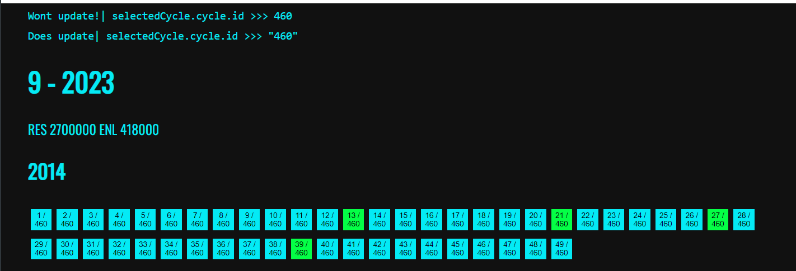
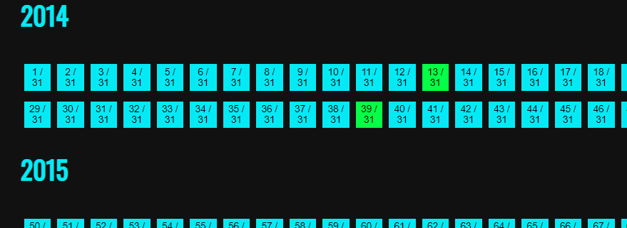

# Svelte 5 Reactivity Bug(????)

Hi, i have created a custom store with runes. It holds a simple game-score object. If the user selects
a Score from the list the store updates with the selected value.

But my UI will not update. But according to $effect & $inspect the value changed succsefully:



````svelte
// in template - will not update ui
<div>
  {{selectedCycle.cycle.id}}
</div>

// will  update ui
<div>
  {{JSON.stringify(selectedCycle.cycle.id)}}
</div>
```

    My Custom Store 
    ```ts
    // src/lib/selectedCycle.svelte.ts
    import type { Cycle } from '../types';

    export function createCycleState(initialValue: Cycle) {
      let cycle = $state<Cycle>(initialValue);

      return {
        get cycle() {
          return cycle;
        },
        set cycle(newValue: Cycle) {
          cycle = newValue;
        }
      };
    }
    ``


## Second Bug - maybe related 

When you click a square, the ID will not update if I add `class:active={selectedCycle.cycle.id === cycle.id}`. 
If removed, everything just works fine.  First Number: square id / Second Number selected id
```ts
//src/lib/components/CycleCard.svelte

<button
	class="bubble"
	onclick={() => (selectedCycle.cycle = cycle)}
	class:enl={cycle.enlightened > cycle.resistance}
	class:active={selectedCycle.cycle.id === cycle.id}  // if add this line reactivity breaks after the first click
  >
	{cycle.id} / {selectedCycle.cycle.id}
</button>
```